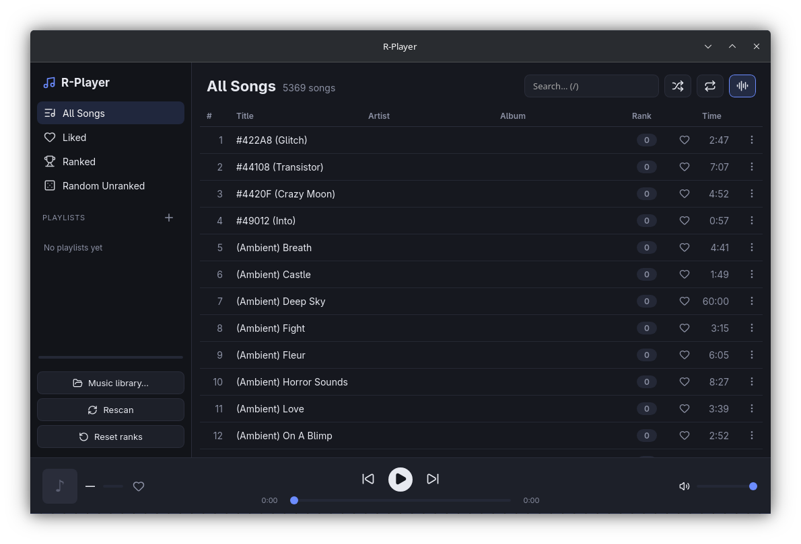

# R-Player

[](https://github.com/richardred15/r-player/actions/workflows/ci.yml)

A clean, modern desktop music player with automatic, listening-based song ranking
and full OS integration. Built with **Tauri v2** (Rust) and **Vanilla TypeScript +
Vite**. See [`spec.md`](./spec.md) for the original product spec.



## Features

- **Local music library** — point it at a folder; it scans recursively (MP3, FLAC,
  OGG/Opus, WAV, M4A) in the background, in parallel, streaming songs into the UI as
  they're found. Comfortable with tens of thousands of tracks (the list is virtualized).
- **Automatic ranking** from how you listen:
  - thumbs-up `+10` (toggle), play to the end `+1`, and a skip penalty based on the
    **fraction of the track heard** (so short songs aren't unfairly punished):
    `<25% → -2`, `25–50% → -1`, `50–90% → 0`, `≥90% → +1` (counts as a full play).
    Every song's rank and liked state shows on every row and in the player bar.
- **Smart playlists** — All Songs, Liked, Ranked, Random Unranked — plus your own
  custom playlists.
- **FFT bar visualizer** (on by default, toggle with `v`).
- **OS integration** — global media keys & "now playing" via MPRIS (Linux), with
  cover art and playback state.
- Shuffle / repeat (off → all → one) over the loaded playlist, search, modal dialogs,
  and **full keyboard shortcuts**. Lucide iconography throughout.
- **Reset ranks** button to wipe all scores/plays/likes and start fresh (keeps the library).

## Keyboard shortcuts

| Key | Action | Key | Action |
| --- | --- | --- | --- |
| `Space` | Play / pause | `s` | Toggle shuffle |
| `→` | Next | `r` | Cycle repeat (off → all → one) |
| `←` | Previous / restart | `v` | Toggle visualizer |
| `l` | Thumbs up current track | `/` | Focus search |
| `n` | New playlist | `Esc` | Close modal |

## Install

Grab a build from the [Releases](https://github.com/richardred15/r-player/releases)
page (Linux x86_64):

```bash
# Arch / CachyOS / Manjaro
sudo pacman -U r-player-*-x86_64.pkg.tar.zst

# Debian / Ubuntu
sudo apt install ./R-Player_*_amd64.deb

# Fedora / RHEL
sudo dnf install ./R-Player-*.x86_64.rpm

# Any distro — AppImage (no install)
chmod +x R-Player_*_amd64.AppImage && ./R-Player_*_amd64.AppImage
```

## Development

```bash
npm install
npm run tauri dev        # run the app (dev server + native window)
npm run test             # scoring unit tests (vitest)
npm run build            # type-check + production frontend build
npm run tauri build      # build the standalone app (deb/rpm bundles)
npm run tauri build -- --no-bundle   # just the binary, no installers
```

> **Build the release with `npm run tauri build`, not `cargo build --release`.** A
> plain `cargo build` produces a *dev-mode* binary that points at the Vite dev server
> (`localhost:1420`) and shows "connection refused" when launched standalone.

### Linux / WebKitGTK notes

- On some Wayland compositors `webkit2gtk`'s DMABUF/compositing renderer crashes on
  launch. The app sets `WEBKIT_DISABLE_DMABUF_RENDERER=1` and
  `WEBKIT_DISABLE_COMPOSITING_MODE=1` at startup to avoid this (see
  `src-tauri/src/main.rs`); override by exporting your own values.
- It also sets `PULSE_LATENCY_MSEC=120` so GStreamer's audio sink doesn't underrun
  (which caused crackly playback on PipeWire).
- Bundle targets are `deb` and `rpm` (AppImage is excluded — it can't be built on
  some filesystems such as NTFS).

## Architecture

- **Frontend** (`src/`): `player.ts` (HTML `<audio>` transport + Web Audio analyser),
  `scoring.ts` (ranking rules, unit-tested), `db.ts` (SQLite via `tauri-plugin-sql`),
  `library.ts` (scan + URL helpers), `scan.ts` (streaming scan consumer), `ui.ts`
  (virtualized track list, sidebar, modal), `icons.ts` (Lucide → SVG), `visualizer.ts`,
  `shortcuts.ts`, `mediaSession.ts`, wired together in `main.ts`.
- **Backend** (`src-tauri/src/`): `library.rs` (parallel `walkdir` + `lofty` scan with
  embedded-art extraction, emitting `scan:*` progress events), `audio_server.rs` (a
  loopback HTTP server that streams files with Range support — WebKitGTK/GStreamer
  can't play Tauri's `asset://` scheme), `media.rs` (`souvlaki` OS media controls),
  `lib.rs` (plugins, SQLite migrations, commands, DB path resolution).
- **Data**: SQLite database at the app data dir
  (`~/.local/share/com.richard.r-player/r-player.db`); schema in
  `src-tauri/migrations/0001_init.sql`. Album art is cached under the app cache dir.

## Status

Developed and tested on Linux (KDE/Wayland). The Rust media integration uses
cross-platform crates, but the app has only been exercised on Linux so far.
